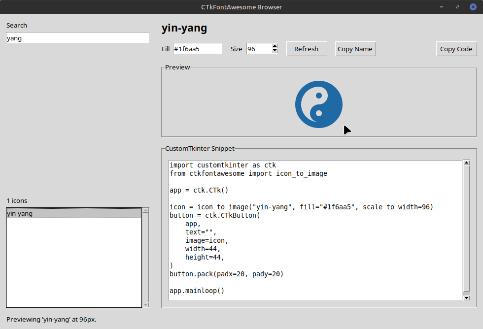

[](https://github.com/avalon60/CTkFontAwesome/issues)
[](https://github.com/avalon60/CTkFontAwesome/blob/main/LICENSE)

# CTkFontAwesome

> Requires Python **3.8+**

CTkFontAwesome is a maintained continuation and repackaging of the original
TkFontAwesome project by Israel Dryer.

A library that enables you to use [FontAwesome icons](https://fontawesome.com/v6/icons?o=r&m=free)
in your CustomTkinter / Tkinter application.

You may use any of the 2k+ *free* [FontAwesome 6.5 icons](https://fontawesome.com/v6/icons?o=r&m=free).
The **fill color** and **size** are customized to your specifications and then converted
to an object via an optional image backend based on CairoSVG and Pillow that can be used anywhere you would use a `tkinter.PhotoImage` object.


## Installation

```shell
python -m pip install ctkfontawesome
```

This installs the icon database and SVG lookup helpers without any native or compiled dependencies.

If you also want `icon_to_image()`, install the optional image dependencies:

```shell
python -m pip install "ctkfontawesome[images]"
```

This installs CairoSVG and Pillow for SVG rasterization and Tk image support.

## Icon Browser

CTkFontAwesome includes an installable icon browser for searching the bundled
Font Awesome set, previewing icons, and copying ready-to-use CustomTkinter code.

```shell
ctkfontawesome-browser
```

The browser itself is included in the base install, but live image previews
require the optional image dependencies:

```shell
python -m pip install "ctkfontawesome[images]"
```



## Development

This repository now supports a Poetry-based development workflow.

```shell
poetry install
```

To install the optional image backend in the Poetry environment:

```shell
poetry install --extras images
```

To run the icon browser during development:

```shell
poetry run ctkfontawesome-browser
```

Once installed, you can launch the browser with:

```shell
ctkfontawesome-browser
```

## Usage

```python
import tkinter as tk
from ctkfontawesome import icon_to_image

root = tk.Tk()
fb = icon_to_image("facebook", fill="#4267B2", scale_to_width=64)
send = icon_to_image("paper-plane", fill="#1D9F75", scale_to_width=64)

tk.Label(root, image=fb).pack(padx=10, pady=10)
tk.Button(root, image=send).pack(padx=10, pady=10)

root.mainloop()
```

## Usage Without Image Dependencies

```python
from ctkfontawesome import icon_to_svg

svg = icon_to_svg("facebook")
print(svg[:80])
```


## API: `icon_to_image()`

```python
(
    name=None,
    fill=None,
    scale_to_width=None,
    scale_to_height=None,
    scale=1
)
```

### Parameters

| Name              | Type  | Description                                                           | Default   |
|-------------------|-------|-----------------------------------------------------------------------|-----------|
| name              | str   | The name of the FontAwesome icon.                                     | None      |
| fill              | str   | The fill color of the svg path.                                       | None      |
| scale_to_width    | int   | Adjust image width to this size (in pixels); maintains aspect ratio.  | None      |
| scale_to_height   | int   | Adjust image height to this size (in pixels); maintains aspect ratio. | None      |
| scale             | float | Scale the image width and height by this factor.                      | 1         |

## API: `icon_to_svg()`

Returns the raw SVG XML string for the requested icon name.

## License

The [CC BY 4.0](https://fontawesome.com/license/free) license applies to all FontAwesome *free* icons used in the library.
The MIT License applies to all other work.

---

**Maintainer**: Clive Bostock
Original project concept and implementation by [Israel Dryer](https://github.com/israel-dryer)
📦 Available on [PyPI](https://pypi.org/project/ctkfontawesome/) | 🐙 [GitHub](https://github.com/avalon60/CTkFontAwesome)
